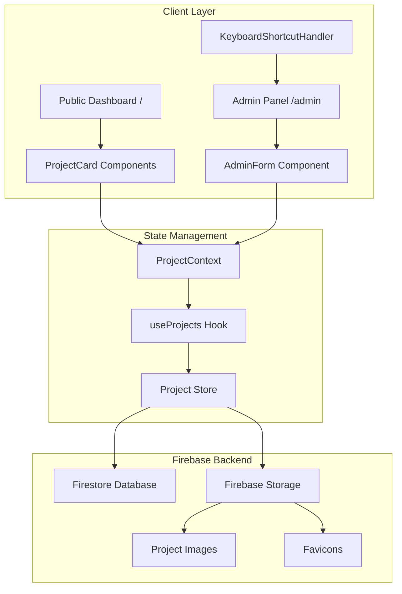

# Design Document: Portfolio Dashboard

## Overview

This document outlines the technical design for a Next.js portfolio dashboard at anshul.space. The system consists of a public-facing project showcase and a hidden admin panel accessible via keyboard shortcut. The architecture prioritizes clean component separation, extensible data layer, and a premium dark-themed UI with subtle animations.

## Architecture



### Technology Stack

- **Framework**: Next.js 14+ (App Router)
- **Styling**: Tailwind CSS with custom design tokens
- **Animations**: Framer Motion
- **State**: React Context + Custom Hooks
- **Database**: Firebase Firestore
- **File Storage**: Firebase Storage
- **Language**: TypeScript

## Components and Interfaces

### Component Hierarchy

```
app/
├── layout.tsx              # Root layout with providers
├── page.tsx                # Public dashboard
├── admin/
│   └── page.tsx            # Admin panel
├── components/
│   ├── ProjectCard.tsx     # Individual project display
│   ├── ProjectGrid.tsx     # Grid container
│   ├── StatusBadge.tsx     # Status indicator
│   ├── EmptyState.tsx      # No projects state
│   ├── AdminForm.tsx       # Project CRUD form
│   ├── AdminProjectList.tsx # Admin project listing
│   ├── ImageUpload.tsx     # Image upload component
│   └── KeyboardShortcut.tsx # Global shortcut listener
├── context/
│   └── ProjectContext.tsx  # Project state provider
├── hooks/
│   ├── useProjects.ts      # Project operations hook
│   └── useKeyboardShortcut.ts # Shortcut detection hook
├── lib/
│   ├── firebase.ts         # Firebase configuration
│   ├── firestore.ts        # Firestore operations
│   ├── storage.ts          # Firebase Storage operations
│   └── validation.ts       # Form validation
└── types/
    └── project.ts          # Type definitions
```

### Core Interfaces

```typescript
// types/project.ts
interface Project {
  id: string;
  name: string;
  description: string;
  websiteUrl: string;
  imageUrl: string;
  faviconUrl: string;
  status: "live" | "wip" | "archived";
  createdAt: string;
  updatedAt: string;
}

interface ProjectFormData {
  name: string;
  description: string;
  websiteUrl: string;
  imageUrl: string;
  faviconUrl: string;
  status: "live" | "wip" | "archived";
}

// context/ProjectContext.tsx
interface ProjectContextValue {
  projects: Project[];
  isLoading: boolean;
  addProject: (data: ProjectFormData) => void;
  updateProject: (id: string, data: ProjectFormData) => void;
  deleteProject: (id: string) => void;
}
```

### Component Specifications

#### ProjectCard

- Displays project thumbnail with aspect ratio 16:9
- Shows favicon (16x16) next to project name
- Renders StatusBadge component
- Implements hover animation: scale(1.02), subtle glow, elevation
- Opens websiteUrl in new tab on click
- Uses Framer Motion for enter/hover animations

#### StatusBadge

- Renders colored dot + text label
- Colors: Live (#22c55e), WIP (#eab308), Archived (#6b7280)
- Pill-shaped with subtle background tint

#### KeyboardShortcut

- Listens for: Ctrl + Shift + Alt + A
- Uses useEffect with keydown event listener
- Validates all modifier keys are pressed simultaneously
- Navigates to /admin using Next.js router
- Cleans up listener on unmount

#### AdminForm

- Controlled form with validation
- Fields: name (required), description (required), websiteUrl (required), imageUrl, faviconUrl, status (select)
- URL validation using URL constructor
- Submit triggers addProject or updateProject based on mode
- Cancel resets form state

## Data Models

### Project Entity

```typescript
{
  id: string,           // UUID v4
  name: string,         // 1-100 characters
  description: string,  // 1-500 characters
  websiteUrl: string,   // Valid URL
  imageUrl: string,     // Valid URL or empty
  faviconUrl: string,   // Valid URL or empty
  status: enum,         // 'live' | 'wip' | 'archived'
  createdAt: string,    // ISO 8601 timestamp
  updatedAt: string     // ISO 8601 timestamp
}
```

### Storage Schema

```typescript
// Firestore collection: 'projects'
// Document ID: auto-generated or UUID

// Firebase Storage paths:
// /projects/{projectId}/thumbnail.{ext}
// /projects/{projectId}/favicon.{ext}

interface FirestoreAdapter {
  getProjects(): Promise<Project[]>;
  getProject(id: string): Promise<Project | null>;
  addProject(data: ProjectFormData): Promise<Project>;
  updateProject(id: string, data: Partial<ProjectFormData>): Promise<void>;
  deleteProject(id: string): Promise<void>;
}

interface StorageAdapter {
  uploadImage(file: File, path: string): Promise<string>;
  deleteImage(path: string): Promise<void>;
}
```

### Seed Data

```typescript
const seedProjects: Project[] = [
  {
    id: "1",
    name: "Flow",
    description: "A minimal focus timer for deep work sessions",
    websiteUrl: "https://flow.anshul.space",
    imageUrl: "/projects/flow.png",
    faviconUrl: "/favicons/flow.ico",
    status: "live",
    createdAt: "2024-01-15T00:00:00Z",
    updatedAt: "2024-01-15T00:00:00Z",
  },
  {
    id: "2",
    name: "Notes",
    description: "Markdown-powered note taking with local-first sync",
    websiteUrl: "https://notes.anshul.space",
    imageUrl: "/projects/notes.png",
    faviconUrl: "/favicons/notes.ico",
    status: "wip",
    createdAt: "2024-02-01T00:00:00Z",
    updatedAt: "2024-02-01T00:00:00Z",
  },
  {
    id: "3",
    name: "Archive",
    description: "Personal bookmarking and web archive tool",
    websiteUrl: "https://archive.anshul.space",
    imageUrl: "/projects/archive.png",
    faviconUrl: "/favicons/archive.ico",
    status: "archived",
    createdAt: "2023-06-01T00:00:00Z",
    updatedAt: "2023-12-01T00:00:00Z",
  },
];
```

## Visual Design System

### Color Palette

```css
/* Background layers */
--bg-primary: #000000;
--bg-secondary: #0a0a0a;
--bg-tertiary: #141414;
--bg-elevated: #1a1a1a;

/* Text */
--text-primary: #ffffff;
--text-secondary: #a1a1a1;
--text-muted: #6b7280;

/* Accent (Cyan) */
--accent: #06b6d4;
--accent-hover: #22d3ee;
--accent-muted: rgba(6, 182, 212, 0.1);

/* Status */
--status-live: #22c55e;
--status-wip: #eab308;
--status-archived: #6b7280;

/* Borders */
--border-subtle: rgba(255, 255, 255, 0.06);
--border-hover: rgba(255, 255, 255, 0.12);
```

### Typography

```css
/* Font: Inter or system-ui */
--font-sans: "Inter", system-ui, sans-serif;

/* Scale */
--text-xs: 0.75rem; /* 12px */
--text-sm: 0.875rem; /* 14px */
--text-base: 1rem; /* 16px */
--text-lg: 1.125rem; /* 18px */
--text-xl: 1.25rem; /* 20px */
--text-2xl: 1.5rem; /* 24px */
--text-3xl: 1.875rem; /* 30px */

/* Weights */
--font-normal: 400;
--font-medium: 500;
--font-semibold: 600;
```

### Spacing System

```css
/* Base unit: 4px */
--space-1: 0.25rem; /* 4px */
--space-2: 0.5rem; /* 8px */
--space-3: 0.75rem; /* 12px */
--space-4: 1rem; /* 16px */
--space-6: 1.5rem; /* 24px */
--space-8: 2rem; /* 32px */
--space-12: 3rem; /* 48px */
--space-16: 4rem; /* 64px */
```

### Animation Tokens

```typescript
// Framer Motion variants
const cardVariants = {
  initial: { opacity: 0, y: 20 },
  animate: { opacity: 1, y: 0 },
  hover: {
    scale: 1.02,
    boxShadow: "0 0 30px rgba(6, 182, 212, 0.15)",
  },
};

const staggerContainer = {
  animate: {
    transition: { staggerChildren: 0.1 },
  },
};

// Timing
const duration = {
  fast: 0.15,
  normal: 0.3,
  slow: 0.5,
};

const easing = {
  smooth: [0.4, 0, 0.2, 1],
};
```

### Grid Layout

```css
/* Project grid */
.project-grid {
  display: grid;
  grid-template-columns: repeat(auto-fill, minmax(320px, 1fr));
  gap: 1.5rem;
}

/* Responsive breakpoints */
@media (max-width: 640px) {
  grid-template-columns: 1fr;
}
@media (min-width: 1024px) {
  grid-template-columns: repeat(3, 1fr);
}
@media (min-width: 1280px) {
  grid-template-columns: repeat(4, 1fr);
}
```

## Correctness Properties

_A property is a characteristic or behavior that should hold true across all valid executions of a system—essentially, a formal statement about what the system should do. Properties serve as the bridge between human-readable specifications and machine-verifiable correctness guarantees._

### Property 1: Project Rendering Completeness

_For any_ list of projects in the store, the rendered dashboard should display a ProjectCard for each project, and each card should contain the project's name, description, and status.

**Validates: Requirements 1.1, 1.2**

### Property 2: Project Card Link Behavior

_For any_ project with a valid websiteUrl, the rendered ProjectCard should have an anchor element with href equal to the websiteUrl and target="\_blank" attribute.

**Validates: Requirements 2.2**

### Property 3: Status Badge Color Mapping

_For any_ project, the StatusBadge component should render with the correct color class based on status: "live" → green, "wip" → yellow/amber, "archived" → gray.

**Validates: Requirements 2.4, 2.5, 2.6, 2.7**

### Property 4: Admin Route Non-Discoverability

_For any_ rendered page in the public dashboard, the HTML output should not contain any anchor elements or references linking to "/admin".

**Validates: Requirements 3.3, 3.4**

### Property 5: Partial Keyboard Shortcut Rejection

_For any_ keyboard event that does not include ALL required modifier keys (Ctrl + Shift + Alt) AND the 'A' key simultaneously, the KeyboardShortcutHandler should not trigger navigation.

**Validates: Requirements 3.5**

### Property 6: Project Creation Persistence

_For any_ valid ProjectFormData, calling addProject should result in the new project being present in both the in-memory state and localStorage, with all fields preserved.

**Validates: Requirements 4.3, 5.3**

### Property 7: Project Update Persistence

_For any_ existing project and valid update data, calling updateProject should result in the project being updated in both in-memory state and localStorage, with the updatedAt timestamp changed.

**Validates: Requirements 4.5, 5.3**

### Property 8: Project Deletion Behavior

_For any_ existing project, calling deleteProject should remove the project from both in-memory state and localStorage. Conversely, if deletion is cancelled, the project should remain unchanged.

**Validates: Requirements 4.7, 4.8**

### Property 9: Storage Round-Trip Consistency

_For any_ array of valid Project objects, saving to localStorage and then retrieving should produce an equivalent array (serialization round-trip).

**Validates: Requirements 5.1, 5.2**

### Property 10: Required Field Validation

_For any_ ProjectFormData where name, description, or websiteUrl is empty or whitespace-only, form validation should fail and return appropriate error messages.

**Validates: Requirements 6.1, 6.2**

### Property 11: URL Format Validation

_For any_ string that is not a valid URL format, the URL validation function should return false and the form should display a URL format error.

**Validates: Requirements 6.3**

## Error Handling

### Firebase Errors

| Error Condition                 | Handling Strategy                                     |
| ------------------------------- | ----------------------------------------------------- |
| Firestore unavailable           | Display error message, retry with exponential backoff |
| Firebase Storage quota exceeded | Display user-friendly error, prevent upload           |
| Network error                   | Show offline indicator, queue changes for sync        |
| Permission denied               | Display authentication error message                  |
| Invalid document data           | Skip invalid entries, log warning                     |

### Form Validation Errors

| Error Condition        | User Feedback                                            |
| ---------------------- | -------------------------------------------------------- |
| Empty required field   | Inline error: "This field is required"                   |
| Invalid URL format     | Inline error: "Please enter a valid URL"                 |
| Duplicate project name | Inline error: "A project with this name already exists"  |
| Image upload failed    | Inline error: "Failed to upload image, please try again" |

### Network/Image Errors

| Error Condition             | Handling Strategy            |
| --------------------------- | ---------------------------- |
| Project image fails to load | Display placeholder image    |
| Favicon fails to load       | Display default favicon icon |

### Implementation

```typescript
// lib/firestore.ts
import {
  collection,
  getDocs,
  addDoc,
  updateDoc,
  deleteDoc,
  doc,
  Timestamp,
} from "firebase/firestore";
import { db } from "./firebase";
import { Project, ProjectFormData } from "@/types/project";

const COLLECTION_NAME = "projects";

export async function getProjects(): Promise<Project[]> {
  try {
    const querySnapshot = await getDocs(collection(db, COLLECTION_NAME));
    return querySnapshot.docs.map((doc) => ({
      id: doc.id,
      ...doc.data(),
    })) as Project[];
  } catch (error) {
    console.error("Firestore read error:", error);
    throw new Error("Failed to fetch projects");
  }
}

export async function addProject(data: ProjectFormData): Promise<Project> {
  try {
    const now = new Date().toISOString();
    const projectData = {
      ...data,
      createdAt: now,
      updatedAt: now,
    };
    const docRef = await addDoc(collection(db, COLLECTION_NAME), projectData);
    return { id: docRef.id, ...projectData };
  } catch (error) {
    console.error("Firestore write error:", error);
    throw new Error("Failed to add project");
  }
}

export async function updateProject(
  id: string,
  data: Partial<ProjectFormData>
): Promise<void> {
  try {
    const docRef = doc(db, COLLECTION_NAME, id);
    await updateDoc(docRef, {
      ...data,
      updatedAt: new Date().toISOString(),
    });
  } catch (error) {
    console.error("Firestore update error:", error);
    throw new Error("Failed to update project");
  }
}

export async function deleteProject(id: string): Promise<void> {
  try {
    await deleteDoc(doc(db, COLLECTION_NAME, id));
  } catch (error) {
    console.error("Firestore delete error:", error);
    throw new Error("Failed to delete project");
  }
}
```

## Testing Strategy

### Dual Testing Approach

This project uses both unit tests and property-based tests for comprehensive coverage:

- **Unit tests**: Verify specific examples, edge cases, and error conditions
- **Property tests**: Verify universal properties across randomly generated inputs

### Testing Framework

- **Test Runner**: Vitest
- **Property-Based Testing**: fast-check
- **Component Testing**: React Testing Library
- **Minimum iterations**: 100 per property test

### Unit Test Coverage

| Component        | Test Focus                                       |
| ---------------- | ------------------------------------------------ |
| ProjectCard      | Renders all fields, click behavior, hover states |
| StatusBadge      | Color mapping for each status                    |
| AdminForm        | Field validation, submit/cancel behavior         |
| KeyboardShortcut | Correct combo triggers, partial combos rejected  |
| Storage          | Read/write operations, error handling            |

### Property Test Coverage

Each correctness property maps to a property-based test:

| Property       | Test File                           | Generator                      |
| -------------- | ----------------------------------- | ------------------------------ |
| Property 1     | `ProjectGrid.property.test.ts`      | Array of valid Project objects |
| Property 2     | `ProjectCard.property.test.ts`      | Valid Project with URL         |
| Property 3     | `StatusBadge.property.test.ts`      | Project with random status     |
| Property 5     | `KeyboardShortcut.property.test.ts` | Partial key combinations       |
| Property 6-8   | `ProjectStore.property.test.ts`     | Valid ProjectFormData          |
| Property 9     | `Storage.property.test.ts`          | Array of Project objects       |
| Property 10-11 | `Validation.property.test.ts`       | Invalid form data              |

### Test Annotation Format

```typescript
/**
 * Feature: portfolio-dashboard, Property 9: Storage Round-Trip Consistency
 * Validates: Requirements 5.1, 5.2
 */
test.prop([fc.array(projectArbitrary)])(
  "storage round-trip preserves data",
  (projects) => {
    saveProjects(projects);
    const retrieved = getProjects();
    expect(retrieved).toEqual(projects);
  }
);
```

### Generator Definitions

```typescript
// test/generators.ts
import * as fc from "fast-check";

export const statusArbitrary = fc.constantFrom("live", "wip", "archived");

export const projectArbitrary = fc.record({
  id: fc.uuid(),
  name: fc.string({ minLength: 1, maxLength: 100 }),
  description: fc.string({ minLength: 1, maxLength: 500 }),
  websiteUrl: fc.webUrl(),
  imageUrl: fc.oneof(fc.webUrl(), fc.constant("")),
  faviconUrl: fc.oneof(fc.webUrl(), fc.constant("")),
  status: statusArbitrary,
  createdAt: fc.date().map((d) => d.toISOString()),
  updatedAt: fc.date().map((d) => d.toISOString()),
});

export const projectFormDataArbitrary = fc.record({
  name: fc.string({ minLength: 1, maxLength: 100 }),
  description: fc.string({ minLength: 1, maxLength: 500 }),
  websiteUrl: fc.webUrl(),
  imageUrl: fc.oneof(fc.webUrl(), fc.constant("")),
  faviconUrl: fc.oneof(fc.webUrl(), fc.constant("")),
  status: statusArbitrary,
});

export const invalidUrlArbitrary = fc.oneof(
  fc.string().filter((s) => !isValidUrl(s)),
  fc.constant("not-a-url"),
  fc.constant("ftp://invalid"),
  fc.constant("://missing-protocol")
);
```
